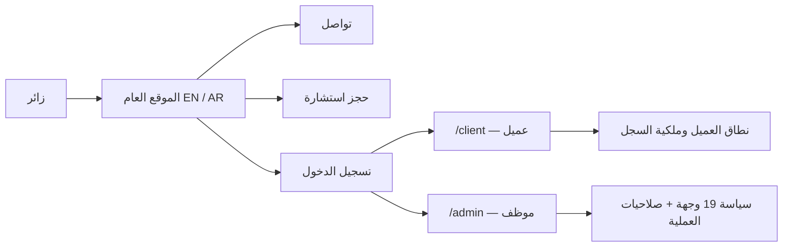

# رحلات المستخدم والأدوار

**لقطة:** 2026-07-28 — commit `9c6821c2`  
**منهج الحكم:** تجربة Chromium محلية للصفحات العامة + تتبع UI/API/service/data + اختبارات الوحدة والعقود. العمليات الناجحة التي تكتب في قاعدة البيانات لم تُنفذ لغياب staging و`DATABASE_URL`.

## خريطة الدخول

- middleware يفرض تسجيل الدخول على `/admin` و`/client` و`/portal`.
- صفحة الإدارة تعيد التحقق من أن الدور staff وأن الوجهة مسموحة.
- الـAPI يعيد التحقق من الصلاحية ونطاق الكائن. إخفاء الرابط وحده ليس آلية الحماية.
- `/portal/*` لا يمثل نظامًا ثانيًا؛ هو تحويل توافق إلى `/client/*`.

## 1. رحلة الزائر

### الاكتشاف

المسارات الأساسية: الرئيسية → الخدمات/تفاصيلها → المحامون/تفاصيلهم → المقالات ودراسات الحالة → الإعلام → التواصل أو الحجز.

| البند | يدخل من | يخرج إلى | الدليل والحكم |
|---|---|---|---|
| الخدمات | header/home CTAs | `/services/{slug}` أو الحجز | browser verified EN/AR |
| المحامون | header/home | `/team/{slug}` أو الحجز | browser verified EN/AR |
| المقالات | header/home | `/articles/{slug}` | القائمة تعمل دون DB؛ المحتوى المنشور الفعلي runtime blocked |
| دراسات الحالة | header/home | `/case-studies/{slug}` | القائمة تعمل دون DB؛ المحتوى المنشور الفعلي runtime blocked |
| الخصوصية والشروط | footer/forms | الوثيقة القانونية | browser verified؛ privacy AR/EN مغطاة |
| تبديل اللغة | header | المسار النظير | desktop/mobile verified؛ اتجاه LTR/RTL صحيح في العينة |

### التواصل

`form → public contact component → POST /api/public/contact → consultation/contact service → Prisma → audit/notification → inline response`

- نجاح التحقق في الواجهة وعرض `requestId` في مسار الخطأ مثبتان بالمتصفح.
- رفض الطلبات cross-origin قبل وصول الـhandler مثبت.
- إدخال الرسالة في DB وظهورها في `/admin/contact-messages` لم يُثبت وقت التشغيل لغياب DB وحساب سكرتير.
- حالات loading/error موجودة ومغطاة. success الحقيقي وnotification الحقيقي غير منفذين.

### الحجز والدفع

`booking chat → POST /api/public/consultations/assistant أو /consultations → slots/checkout → payment provider → webhook → receipt/return`

- واجهة الحجز، التحقق، analytics، واتجاه العربية تعمل محليًا.
- المساعد العام المستخدم فعليًا هو `consultation-booking-chat.tsx`. المكوّن الأقدم `consultation-assistant-panel.tsx` غير مستدعى.
- نجاح إنشاء الاستشارة، حجز slot، checkout، webhook، تحديث حالة الدفع والإيصال لم تُثبت على staging.
- بوابات Paymob/PayTabs موجودة في الكود، لكن الحكم التشغيلي يعتمد على secrets/configuration والـDB.
- SMTP و2FA وبعض إعدادات الدفع المؤجلة تُصنف “معطلة بإعداد/قرار” لا “مكسورة”.

### حالات التجربة العامة

| الحالة | ما تم إثباته |
|---|---|
| loading | عناصر النماذج تمنع الإرسال المتكرر وتعرض busy state في المصدر والاختبارات |
| empty | المقالات ودراسات الحالة لا تعرض روابط قديمة عند غياب DB |
| error | رسائل آمنة و`requestId` في التواصل والحجز مثبتة بالمتصفح |
| success | عقد الاستجابة موجود؛ أثر DB غير مثبت |
| denied | cross-origin mutation مرفوض؛ المسارات المحمية تحول إلى login |
| mobile/RTL | 390px EN/AR بلا page-level overflow في smoke |
| accessibility | keyboard/mobile menu/reduced-motion مغطاة في حزم Playwright ذات الصلة |

## 2. رحلة العميل

### الدخول والتهيئة

1. موظف مخول ينشئ/يربط حساب العميل، أو العميل يفتح رابط `/client-account/setup`.
2. `POST /api/public/client-account/setup` يتحقق من token ويضبط الحساب.
3. login ينشئ session لمستخدم ودور نشطين فقط.
4. `/client` يرفض أي دور غير Client وأي مستخدم بلا `clientId`.

الـsession يعيد تحميل `role.permissions` من قاعدة البيانات؛ لذلك الصلاحيات الفعلية ليست نسخة ثابتة من JSON. لم يمكن مطابقة seed مع DB حقيقية في هذا التدقيق.

### ما يستطيع العميل فعله

| الوجهة | العمليات | النطاق |
|---|---|---|
| `/client` | قراءة الملخص | `clientId` المرتبط فقط |
| `/client/cases` | عرض القضايا | own client فقط |
| `/client/cases/{caseId}` | عرض تفاصيل القضية | own case فقط |
| `/client/court-dates` | عرض المواعيد | own appointments/cases |
| `/client/files` | عرض/تنزيل/رفع | own case أو document `CLIENT_VISIBLE` لمالكه |
| `/client/payments` | عرض المدفوعات | own payments فقط |
| `/client/assistant` | بدء/متابعة محادثة | own conversation فقط |
| `/client/profile` | عرض/تعديل | self user/client فقط |

### ما لا يستطيع العميل فعله

- لا يدخل أي وجهة `/admin`.
- لا يقرأ قضية، مستندًا، محادثة أو دفعة لعميل آخر؛ الخدمة تطبق object scope.
- لا يغيّر role أو permissions أو staff data.
- لا يستطيع الوصول لمجرد معرفة ID؛ الخدمة تعيد denied/not found دون كشف غير لازم.

### فجوات الإثبات والتجربة

- source/unit tests تثبت ownership filters، لكن مسار نجاح + مسار منع بصفوف DB فعلية لم يُنفذا.
- الواجهة المحمية عربية فقط حاليًا، ومعظم نصوص تنقل العميل hardcoded داخل `client-navigation.ts` و`client-site-shell.tsx` بدل catalog مشترك. هذا دين i18n وليس عطلًا في RTL.
- حالات loading/empty/error موجودة في الصفحات، لكن لم تُرصد بحساب Client حقيقي.

## 3. رحلة الموظفين والداشبورد

### الأدوار الافتراضية

| الدور | عدد الصلاحيات الافتراضية | وجهات الإدارة | النطاق الأساسي |
|---|---:|---:|---|
| Lawyer | 14 | 8 | assigned records |
| Secretary | 23 | 14 | office-wide operational |
| Office Admin | 23 | 14 | office-wide operational |
| Marketing Staff | 6 | 3 | content creation + own notifications |
| Super Admin | `*` | 19 | all، مع حراس خاصة |

Guest لديه 5 صلاحيات عامة وClient لديه 12 صلاحية self/own، ولا يدخل أي منهما الإدارة.

### وجهات الإدارة الـ19

| الوجهة | Lawyer | Secretary | Office Admin | Marketing | Super Admin |
|---|:---:|:---:|:---:|:---:|:---:|
| Dashboard | ✓ | ✓ | ✓ | ✓ | ✓ |
| Consultation availability | — | ✓ | ✓ | — | ✓ |
| Consultations | ✓ assigned | ✓ | ✓ | — | ✓ |
| Clients | ✓ assigned | ✓ | ✓ | — | ✓ |
| Messages | — | ✓ | ✓ | — | ✓ |
| Cases | ✓ assigned | ✓ | ✓ | — | ✓ |
| Create case | — | ✓ | ✓ | — | ✓ |
| Calendar | ✓ assigned | ✓ | ✓ | — | ✓ |
| Tasks | ✓ assigned | ✓ | ✓ | — | ✓ |
| Documents | ✓ assigned | ✓ | ✓ | — | ✓ |
| Finance | — | ✓ | ✓ | — | ✓ |
| Reports | — | ✓ | ✓ | — | ✓ |
| Content | — | — | — | ✓ create | ✓ |
| Contact messages | — | ✓ | ✓ | — | ✓ |
| Notifications | ✓ | ✓ | ✓ | ✓ | ✓ |
| Users | — | — | — | — | ✓ |
| Roles | — | — | — | — | ✓ |
| Settings | — | — | — | — | ✓ |
| Audit log | — | — | — | — | ✓ |

القيم التفصيلية القابلة للفرز موجودة في `03-role-action-matrix.csv`.

### المحامي

- يقرأ ويحدث القضايا والعملاء والمستندات والمهام والجلسات المسندة إليه.
- يراجع الاستشارة المسندة، لكنه لا يملك `consultation.review.any`، لذلك لا يسند استشارة بنفسه.
- لا ينشئ قضية office-wide، لا يدير المالية أو المستخدمين أو الإعدادات، ولا يحذف مستندًا بصلاحية `document.manage.any`.
- dashboard لا يعرض له إلا metrics/queues التي يملك نطاقها.

### السكرتير ومدير المكتب

- الاثنان متساويان **بالضبط** في `policy-data.json`: 23 صلاحية و14 وجهة.
- كلاهما يدير القضايا والعملاء والمواعيد والمهام والمستندات والمحادثات والمالية والتقارير والتواصل.
- كلاهما لا يدير المستخدمين أو الأدوار أو الإعدادات أو سجل التدقيق في الإعداد الافتراضي.
- هذا قد يكون قرارًا تجاريًا صحيحًا، لكنه لا يحقق فصل مسؤوليات بين “سكرتير” و“مدير مكتب”. يجب اعتماد القرار أو تقسيم الصلاحيات.

### التسويق

- يدخل dashboard، المحتوى والإشعارات فقط.
- ينشئ article/case study/social draft.
- لا يملك صلاحيات approve الافتراضية، فلا ينبغي أن ينشر/يعتمد وحده.
- dashboard الخاص به لا يتلقى KPIs تشغيلية للقضايا والعملاء.

### المدير العام

- الدور الوحيد الذي يدخل المستخدمين والأدوار والإعدادات وسجل التدقيق.
- تعديل الصلاحيات يتطلب الدور المطابق Super Admin **بالإضافة** إلى `role.manage.any` و`permission.manage.any`.
- لا يمكن تعديل Guest/Client/Super Admin من شاشة تفويض الأدوار؛ الأدوار التشغيلية فقط قابلة للتعديل.
- توجد حماية final Super Admin، optimistic concurrency، transaction وعملية audit في مسارات الحوكمة.
- reset 2FA لا يعمل لأنه مؤجل ويرجع `503 FEATURE_DISABLED`.

## 4. منطق الداشبورد

`GET /api/admin/dashboard` يبني snapshot حسب الدور، وليس payload واحدًا يُخفى بعد وصوله للمتصفح.

### المقاييس العشرة

`appointments.today`, `tasks.overdue`, `consultations.unreviewed`, `consultations.overdue_unbooked`, `consultations.awaiting_result`, `consultations.missed`, `contacts.new`, `documents.under-review`, `cases.active`, `clients.active`.

### قوائم الأولوية

tasks، appointments، consultations، contacts، documents؛ كل قائمة بحد أقصى 6 عناصر. فشل loader واحد يعيد `unavailable` لهذا الجزء فقط.

### مطابقة البطاقات

- كل metric يحمل `href` بفلتر يتطابق مع تعريف العد.
- حدود “اليوم” محسوبة في `Africa/Cairo`.
- الاستعلامات تعيد DTOs محدودة ولا ترسل notes/phone/raw errors بلا حاجة.
- اختبارات الوحدة تثبت scope والروابط والحدود والأحجام.
- لم تُقارن الأرقام مع PostgreSQL حقيقية، لذلك الحكم الحالي **static-pass/runtime-blocked**.

## 5. نقاط الاستمرار والخروج

| الرحلة | نجاح متوقع | خروج/تعافٍ |
|---|---|---|
| زائر → تواصل | رسالة مرجعية ثم triage | validation، safe error + requestId، retry |
| زائر → حجز | consultation/appointment ثم دفع أو تأكيد | slot conflict، gateway unavailable، retry |
| عميل → ملف | تنزيل/رفع ضمن النطاق | 401/403/404، storage error |
| محامٍ → قضية | تحديث assigned case وتسجيل audit | deny unassigned، conflict، not found |
| سكرتير → موعد | إنشاء/إعادة جدولة | `APPOINTMENT_CONFLICT` |
| تسويق → محتوى | حفظ draft | approve denied بلا صلاحية |
| Super Admin → صلاحيات | استبدال atomic audited | stale-write/conflict، protected role |

## خلاصة القبول

- تغطية المسارات والأدوار في الكود: مكتملة.
- الزائر وmobile/RTL: مثبتان محليًا.
- نجاح ومنع العمليات الحساسة على DB: **غير مكتمل** بسبب غياب staging.
- UI/API/data effect المتكامل: **لا يُعلن passed** حتى تشغيل حزمة DB والـlive admin بحسابات وهمية.

